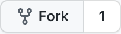
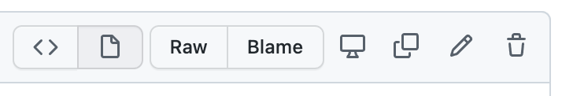
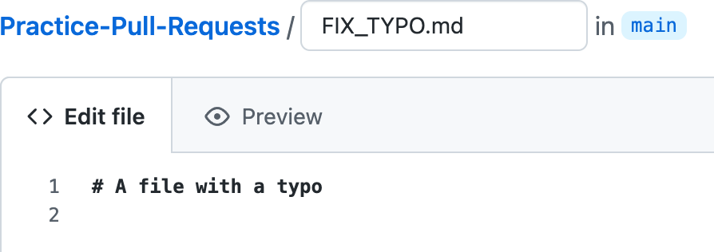
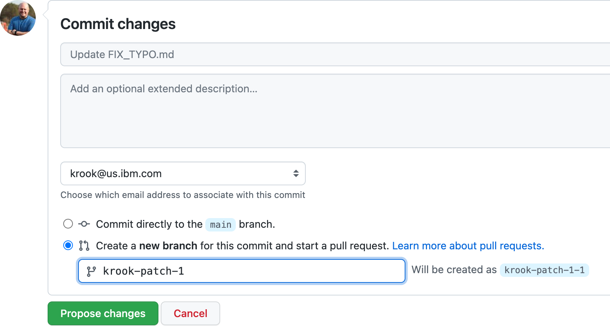
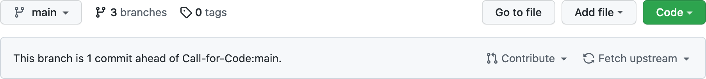
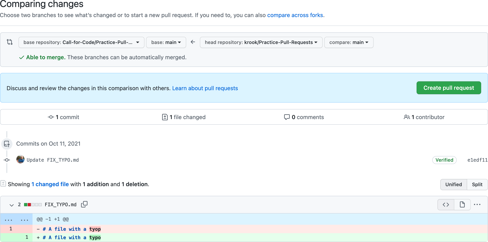
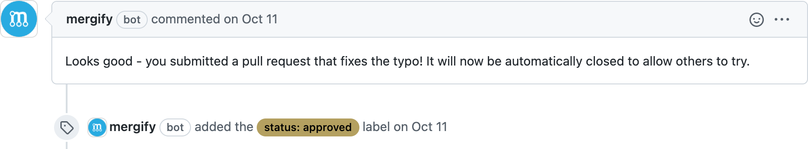
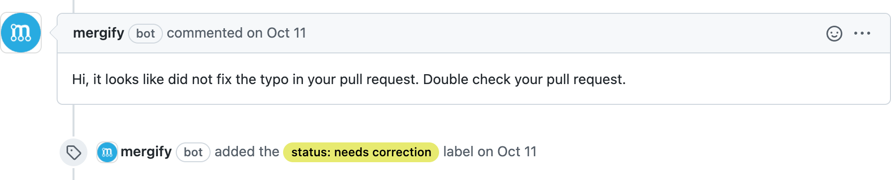

# Practicing GitHub pull requests

 

If you're new to GitHub and want to get involved with an open source community like [Call for Code](https://github.com/Call-for-Code/Project-Catalog), the process for adding code or text contributions to a particular project can be a bit daunting.

That's why we created this contribution practice repository. You can feel free to work through the important steps needed to make your first contribution.

## How it works

Each Call for Code project typically has at four files in it that describe how new contributors can take part in the community.

1. The `README.md` file. It's this document you're reading right now. It's the first file you look at to understand what a project is, what it does, and who's involved.

1. The `LICENSE` file. While all open source code is free for anyone to inspect, it doesn't necessarily mean you can do what you want with it. This file establishes the terms of use, which normally are quite free.

1. The `CONTRIBUTING.md` file. This file provides the rules of the road for contributing to a project. It defines any rules around the format for opening issues (reporting bugs) or submitting changes back to the project.

1. The code itself (here represented by `FIX_TYPO.md`). Once you understand the three files above, you can then begin to contribute! In this repo, we invite you to test sending a pull request to this project. It will let you know whether you got it right or wrong.

## Give it a try (using just a web browser)

1. Log into GitHub if you haven't already.

1. On the top right of this repository, click the "Fork" button to create a copy in your account.

   

1. Click on the `FIX_TYPO.md` in your copy.

1. Click on the pencil icon in the edit bar for the file.

   

1. Fix the typo

   

1. Commit to a new branch in your fork by clicking "Propose changes".

   

1. Back on the main page of your fork, you should now see a message that your code is newer than the original repo.

   

1. Click "Contribute", then "Open pull request".

   

1. Review the changes which should look like this, then click "Create pull request". Make sure that it's comparing your branch with the original `main` branch in the upstream **Call-for-Code** repository, not the `main` branch of your fork.

   > Note: The screenshot actually shows it comparing my `main` to the upstream `main`, but it should show `krook-patch-1`.

   

1. The pull request (proposed change for the main repository to accept) will then be opened.

1. One of two things will happen, either the Mergify workflow will tell you were successful.

   

1. Otherwise it will tell you to try again.

   

## Next steps

After you've gotten the hang of things through this pull request practice repository, we encourage you to continue learning more about contributing to open source.

1. Spend 4-6 hours on the [**free "Introduction to Open Source" class**](https://cognitiveclass.ai/courses/introduction-to-open-source). It's intended for technical and non-technical folks alike to learn about open source, which is becoming a key skill in today's world. You can earn a badge and certificate after completion.

1. Explore the existing [**Call for Code projects**](https://github.com/Call-for-Code/Project-Catalog) and make your first contribution! Anything from a small typo fix, to a language translation or documentation update, to an important code fix is welcome!

1. If you want to create a new project and continue learning about best practices for using your own GitHub repository, check put the [**Project Sample**](https://github.com/Call-for-Code/Project-Sample). Folks use this to create Call for Code competition entries and start their own open source communities.
